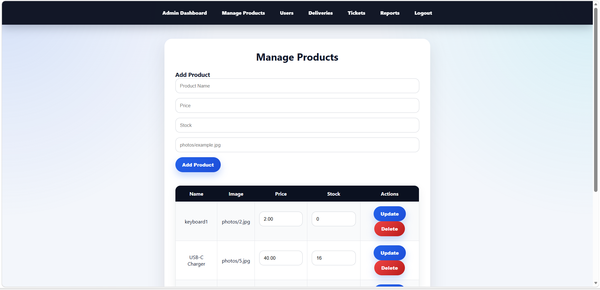
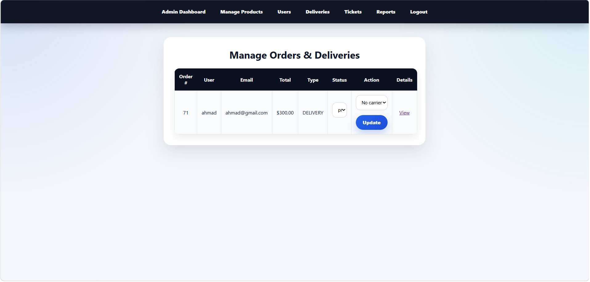
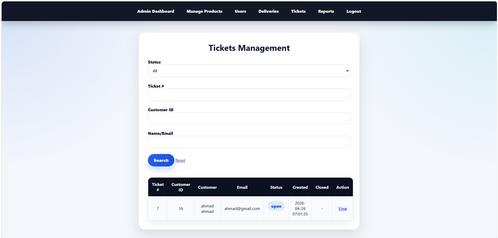
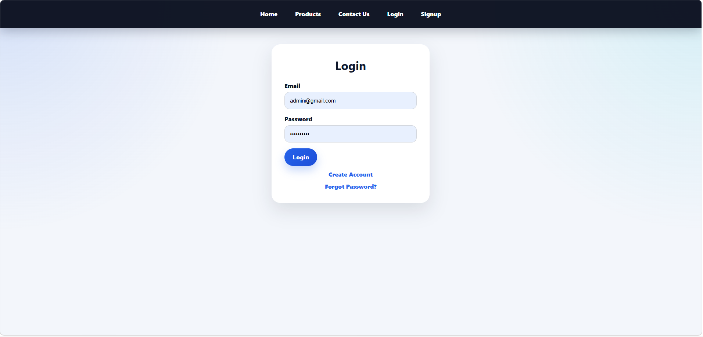
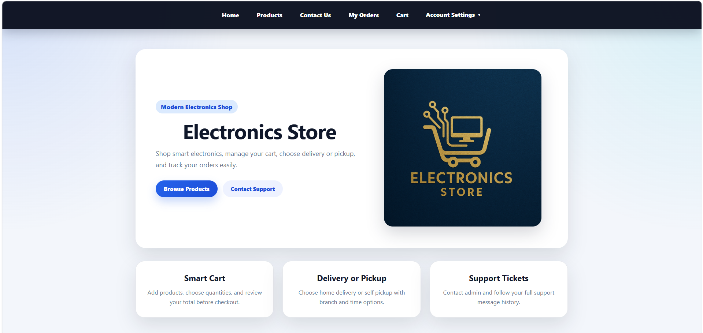
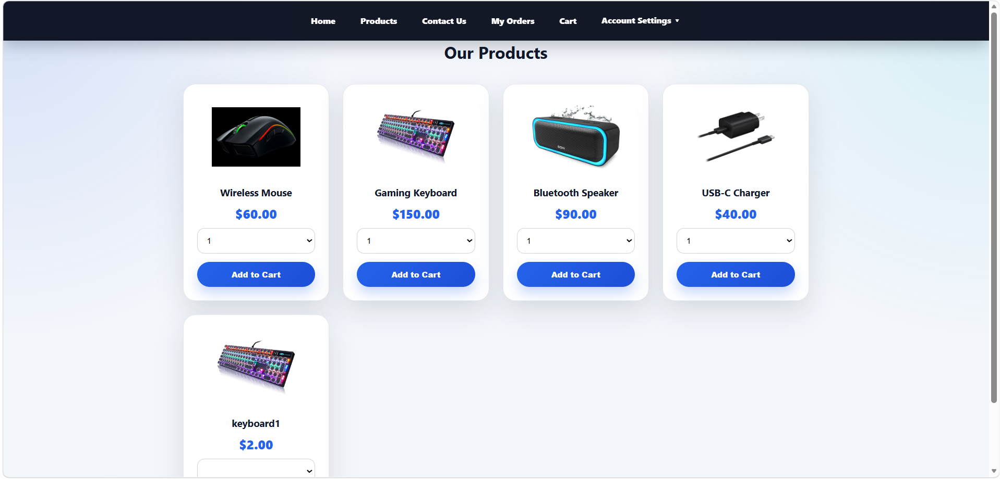
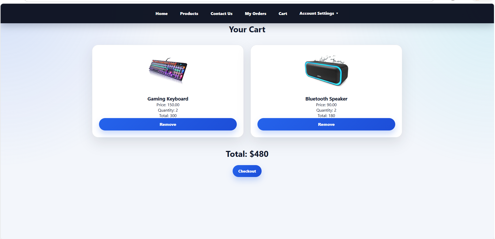
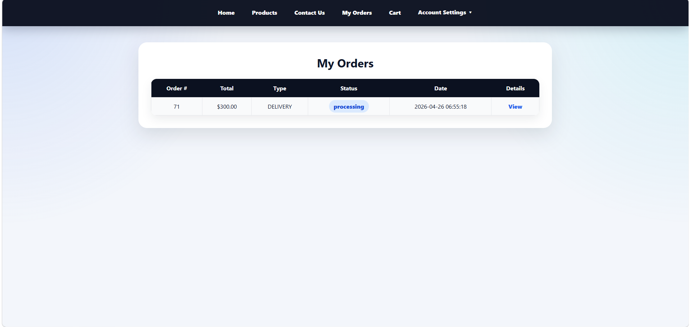
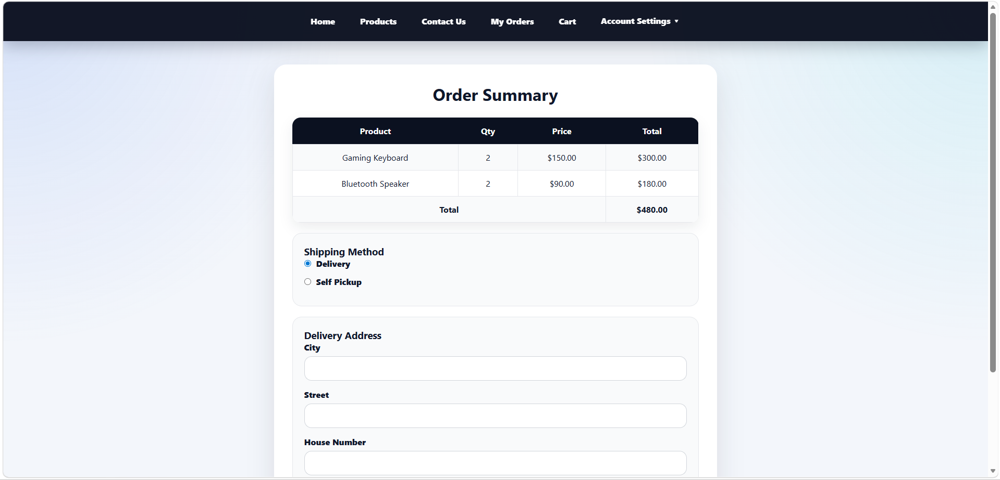
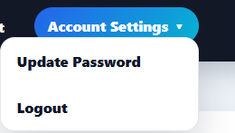

# Electronics Store - E-Commerce Web Application

Electronics Store is a full-stack e-commerce web application built using **PHP and MySQL**, allowing users to browse products, manage a shopping cart, and place orders.

> **Status:** Work in Progress – This project is still under active development.

---

##  Features

###  User (Customer)

* User registration and login
* Browse electronic products
* Add products to cart
* Manage cart items
* Place and view orders
* Update profile and logout

---

###  Admin Panel

* Manage products
* Manage users
* View and manage orders
* Control system data

---

##  Database

The system uses a MySQL database to manage:

* Users
* Products
* Cart
* Orders

The database is designed with:

* Structured tables
* Relationships between entities
* Organized data storage

---

##  Screenshots

###  Admin Panel






---

###  Customer Pages

#### Login Page



#### Home Page



#### Products Page



#### Cart Page



#### Orders Page



#### Order Summary



#### Profile / Update / Logout



---

##  Technologies Used

* PHP
* MySQL
* HTML
* CSS
* XAMPP / WAMP
* Visual Studio Code

---

##  How to Run the Project

1. Move the project folder to:

```id="r6fd9t"
xampp/htdocs/
```

or

```id="yg5ixp"
wamp64/www/
```

2. Start Apache and MySQL

3. Import the database into phpMyAdmin

4. Open in browser:

```id="r6t7rs"
http://localhost/PROJECT2/
```

---

##  Current Limitations

* Some features are still under development
* UI improvements are planned
* No live deployment yet (runs locally only)

---

##  Project Highlights

* Full-stack e-commerce system
* Shopping cart and order workflow
* Admin panel for system management
* MySQL database integration
* Organized backend structure

---

##  Author

Mohammad Bakri
Software Engineering Student

---

## Notes

This project is part of my learning journey and is continuously being improved.
